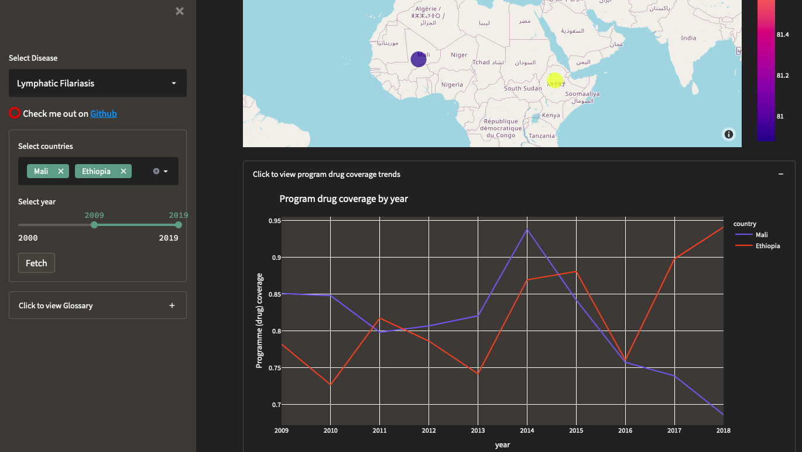

## NTD Data Explorer App
---
This app lets you explore STH and LF Datasets form the WHO Dataset.

### Features
This app allows you to:
+ 🔭 View country level LF & STH data - individually or comparatively
+ 📍 View air measurement locations
+ 🥰 Save the universe!

### In the wild
😋 [Check it out here](https://share.streamlit.io/akele-guzay/ntd/app.py)

### Upcoming Features
+ 🔜 Downloadable PDF reports
